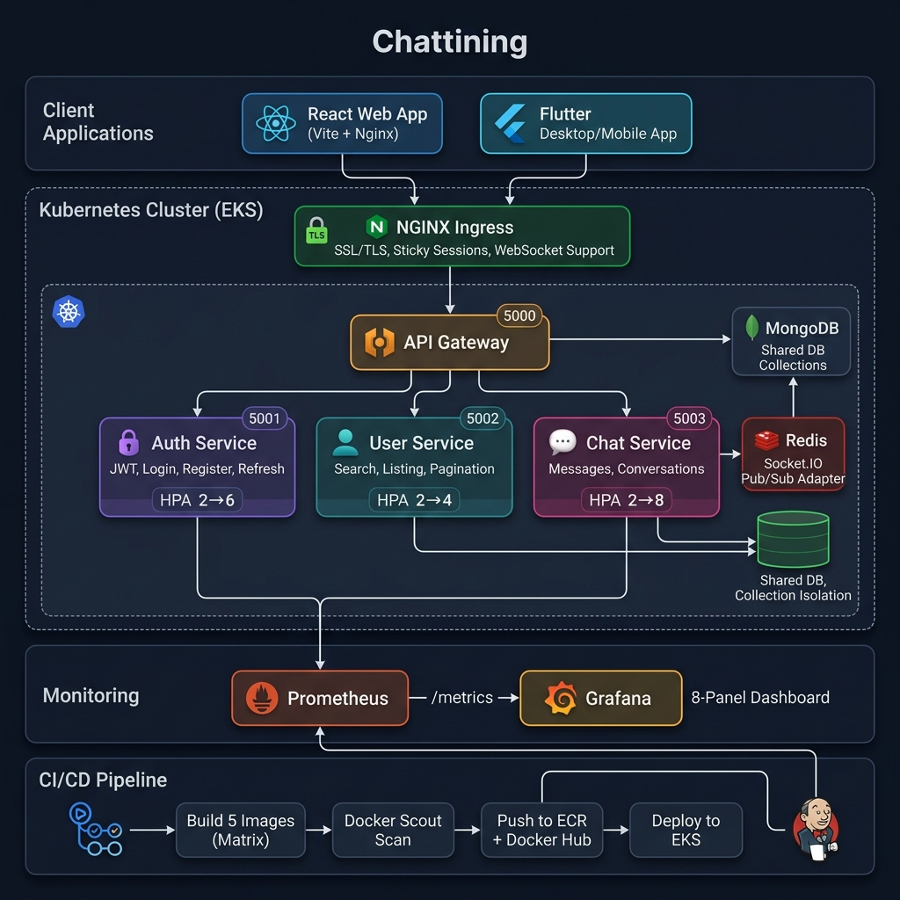
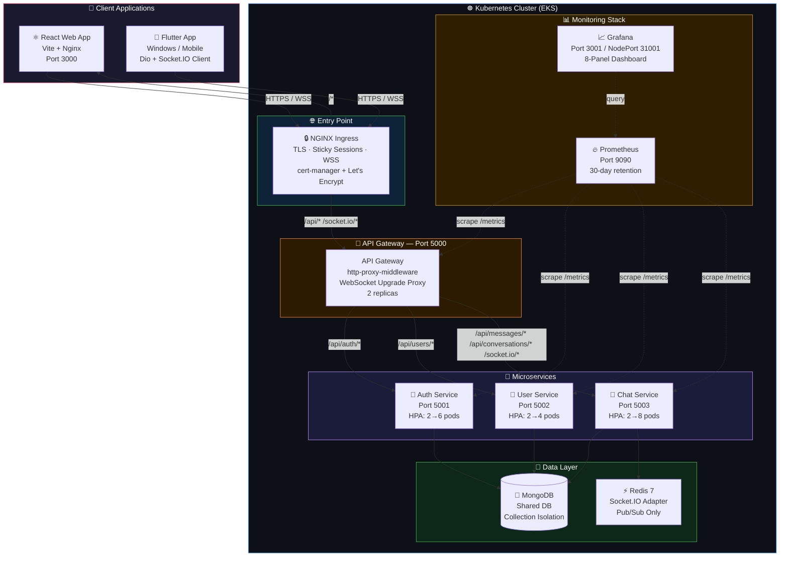
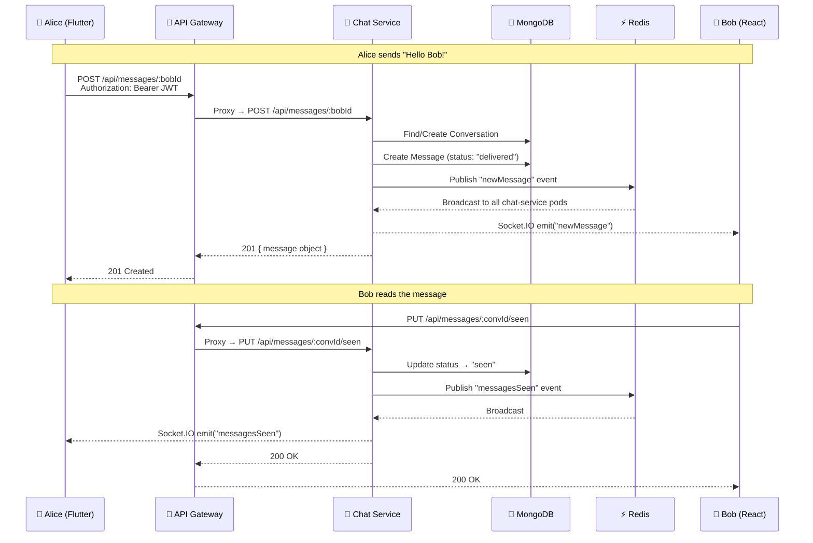
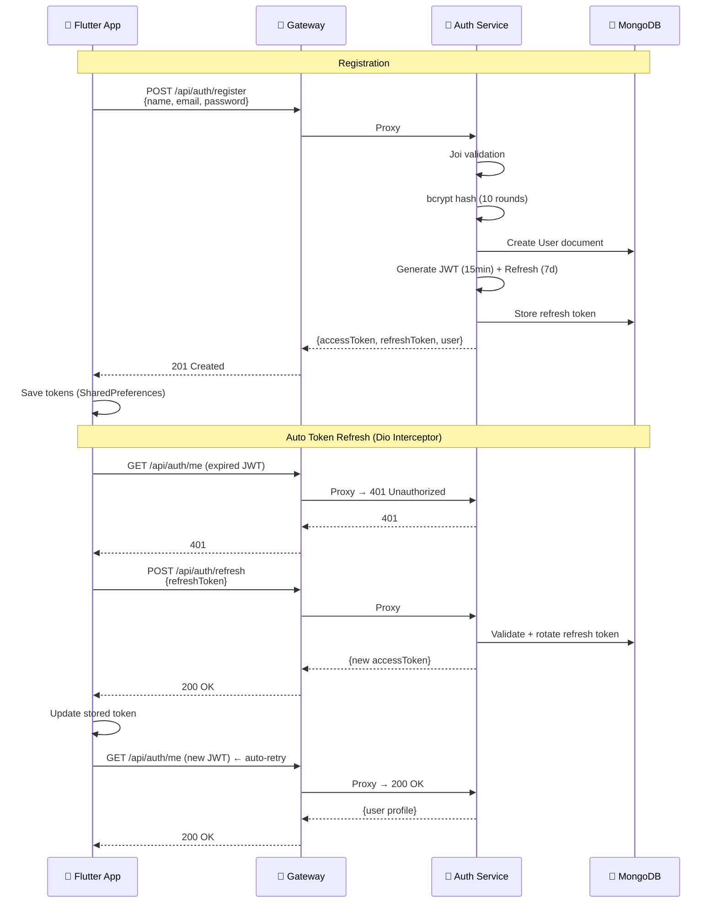
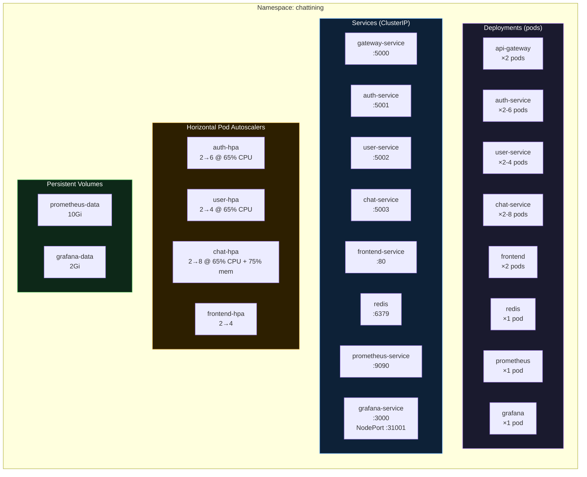
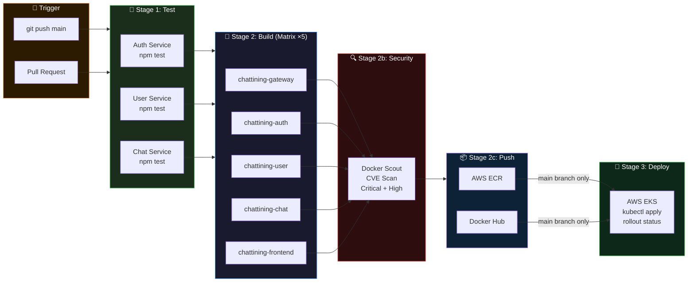
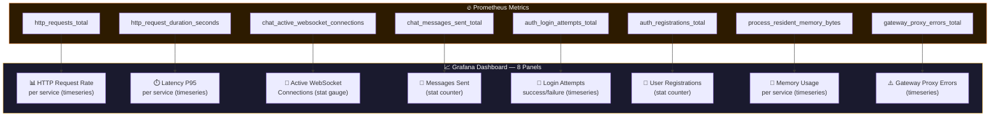

# 🏗️ Chattining Application — Complete Architecture



---

## 1. Complete System Overview



---

## 2. Microservice Detail — What Each Service Does

````carousel
### 🔐 Auth Service (Port 5001)
```
Endpoints:
  POST /api/auth/register  → Create account (name, email, password)
  POST /api/auth/login     → JWT access token (15min) + refresh token (7d)
  POST /api/auth/refresh   → Rotate access token using refresh token
  POST /api/auth/logout    → Invalidate refresh token
  GET  /api/auth/me        → Get current user profile

Security:
  ✅ bcrypt (10 salt rounds)
  ✅ Joi input validation
  ✅ Rate limiting (5 attempts/min/IP)
  ✅ Refresh token rotation in MongoDB

HPA: 2 → 6 pods (65% CPU threshold)
```
<!-- slide -->
### 👤 User Service (Port 5002)
```
Endpoints:
  GET /api/users              → List all users (paginated)
  GET /api/users/search?query= → Search by name/email

Search Strategy:
  query.length < 3  → MongoDB regex (case-insensitive)
  query.length >= 3 → MongoDB $text index (full-text)

HPA: 2 → 4 pods (65% CPU threshold)
```
<!-- slide -->
### 💬 Chat Service (Port 5003)
```
REST Endpoints:
  POST /api/messages/:receiverId    → Send message
  GET  /api/messages/:conversationId → Get message history
  PUT  /api/messages/:convId/seen   → Mark messages as read
  GET  /api/conversations            → List conversations

WebSocket Events (Socket.IO):
  connection     → Track user online, deliver pending messages
  join chat      → Join conversation room
  newMessage     → Real-time message delivery
  typing         → Typing indicator
  stop typing    → Stop typing indicator
  messagesDelivered → Delivery receipts
  messagesSeen   → Read receipts (blue ticks)
  getOnlineUsers → Broadcast online user list
  disconnect     → Remove from tracking

Message Status Flow:
  sent → delivered (receiver online) → seen (receiver reads)

HPA: 2 → 8 pods (65% CPU, 75% memory)
Resources: 256Mi–512Mi RAM (holds WebSocket connections)
```
<!-- slide -->
### 🚪 API Gateway (Port 5000)
```
Proxy Routes:
  /api/auth/*         → auth-service:5001
  /api/users/*        → user-service:5002
  /api/messages/*     → chat-service:5003
  /api/conversations/* → chat-service:5003
  /socket.io/*        → chat-service:5003 (WebSocket upgrade)

Key Implementation:
  ✅ http-proxy-middleware v3
  ✅ http.createServer() for WS upgrade
  ✅ server.on('upgrade', socketProxy.upgrade)
  ✅ pathRewrite to restore Express-stripped mount prefix
  ✅ prom-client metrics at /metrics

2 replicas (no HPA — lightweight reverse proxy)
Resources: 128Mi–256Mi RAM
```
````

---

## 3. Data Flow — Sending a Chat Message



---

## 4. Authentication Flow



---

## 5. Kubernetes Deployment Topology



---

## 6. CI/CD Pipeline



---

## 7. Monitoring — Grafana Dashboard Panels



---

## 8. File Structure — Quick Reference

```
chattining-application/
├── 📱 flutter_chat_app/          ← Flutter Desktop/Mobile Client
│   └── lib/
│       ├── config/               (API URLs, theme)
│       ├── models/               (UserModel)
│       ├── providers/            (AuthProvider, ChatProvider)
│       ├── screens/              (Login, Register, Chat)
│       ├── services/             (AuthService, SocketService, ApiService)
│       └── main.dart
│
├── ⚛️  frontend/                  ← React Web Client (Vite)
│   ├── Dockerfile
│   └── src/
│
├── 🔧 services/                  ← Microservices (Node.js)
│   ├── api-gateway/              Port 5000 — Reverse proxy
│   ├── auth-service/             Port 5001 — JWT, login, register
│   ├── user-service/             Port 5002 — Search, listing
│   └── chat-service/             Port 5003 — Messages, Socket.IO
│
├── ☸️  k8s/
│   ├── production/               ← 14 K8s manifests (27 docs)
│   │   ├── namespace.yaml
│   │   ├── configmap.yaml        (chattining-config)
│   │   ├── secrets.yaml          (chattining-secrets)
│   │   ├── redis-deployment.yaml
│   │   ├── gateway-deployment.yaml
│   │   ├── auth-deployment.yaml  (+ HPA)
│   │   ├── user-deployment.yaml  (+ HPA)
│   │   ├── chat-deployment.yaml  (+ HPA)
│   │   ├── frontend-*.yaml      (deploy + service + HPA)
│   │   ├── prometheus-deployment.yaml
│   │   ├── grafana-deployment.yaml
│   │   └── ingress.yaml
│   └── (dev manifests — historical)
│
├── 📊 monitoring/
│   ├── prometheus/prometheus.yml  ← Scrape config
│   └── grafana/                   ← Dashboard JSON + provisioning
│
├── 🔄 .github/workflows/
│   ├── docker-publish.yml         ← Build 5 images (matrix)
│   └── deploy.yml                 ← Full CI/CD → EKS
│
├── 🐳 docker-compose.yml         ← 9 services local orchestration
├── 📋 Jenkinsfile                 ← Parallel build pipeline
├── 📖 PROJECT_PROGRESS_REPORT.md  ← Phase-by-phase dev log
├── ✅ FEATURE_CHECKLIST.md        ← Complete feature tracking
└── 🤝 SESSION_HANDOFF.md         ← Quick context summary
```

---

## 9. Port Map — Quick Reference

| Port | Service | Access |
|------|---------|--------|
| **5000** | API Gateway | All client traffic enters here |
| 5001 | Auth Service | Internal only (via gateway) |
| 5002 | User Service | Internal only (via gateway) |
| 5003 | Chat Service | Internal only (via gateway) |
| 6379 | Redis | Internal only (Socket.IO adapter) |
| 27017 | MongoDB | Internal only |
| 3000 | Frontend (React) | Via Ingress `/` |
| 9090 | Prometheus | Internal (port-forward to access) |
| 31001 | Grafana | NodePort (direct access) |

---

> **💡 One sentence to remember it all:**
> *Clients hit the **NGINX Ingress** → **API Gateway** (port 5000) routes to **Auth/User/Chat** microservices → all backed by **MongoDB** + **Redis** → monitored by **Prometheus + Grafana** → deployed via **GitHub Actions matrix** to **AWS EKS**.*
