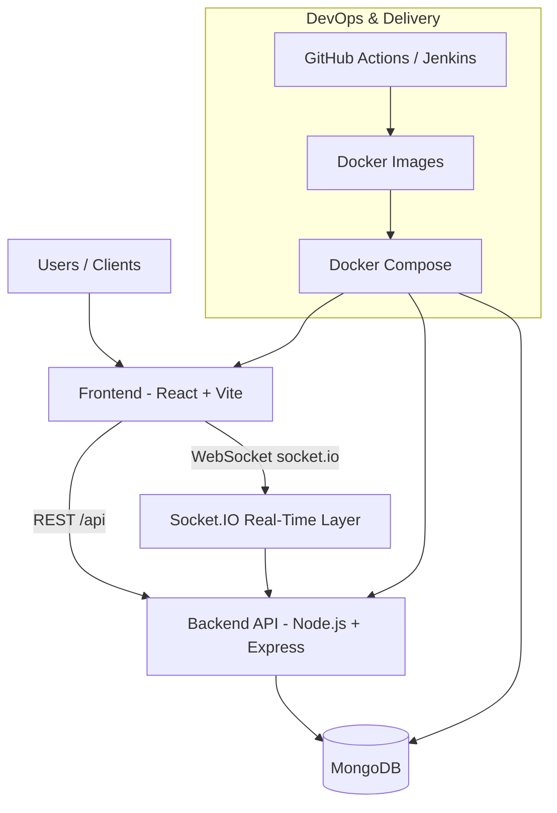

# kubechat-microservices

kubechat-microservices is a real-time chat platform built with a microservices-ready architecture using React, Node.js, Socket.IO, MongoDB, Docker, and CI/CD pipelines.

## Why use this project?

- To build and run a production-oriented real-time chat system with modern web technologies.
- To learn how to combine REST APIs and WebSockets for fast, reliable messaging.
- To deploy a full-stack chat platform with containerized services and automation-ready pipelines.
- To use as a base project for extending into Kubernetes-native service deployments.

## Who is this project made for?

- Developers building messaging products.
- Students learning full-stack real-time application architecture.
- Teams prototyping internal communication tools.
- Engineers who want a practical microservices migration starting point.

## What problem does this project solve?

This project solves the challenge of building a complete, scalable, real-time communication app from scratch by providing:

- Secure authentication and token lifecycle handling.
- Fast user discovery and conversation management.
- Live messaging with typing indicators and delivery/read status updates.
- Multi-device socket delivery support.
- Containerized deployment flow for backend, frontend, and database services.

## Project structure diagram

## Core implementation areas

- Authentication and security
- User search and pagination
- Conversation and message lifecycle
- Delivery status and read receipts
- Real-time Socket.IO communication
- Frontend chat workspace and UX
- Dockerized deployment and CI/CD automation

## Architecture documentation

| Document | What it covers |
|---|---|
| [ARCHITECTURE.md](ARCHITECTURE.md) | Full system overview — all services, data flows, Kubernetes config, monitoring |
| [docs/API_GATEWAY_DEEP_DIVE.md](docs/API_GATEWAY_DEEP_DIVE.md) | In-depth explanation of the API Gateway (port 5000): routing, WebSocket proxying, path rewriting, Prometheus metrics, CORS, error handling, and interview talking points |
