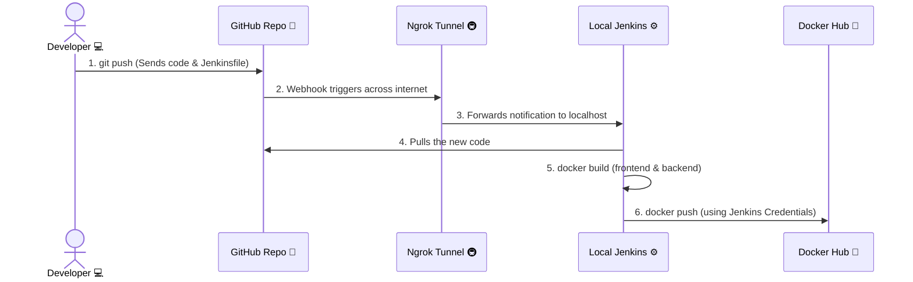
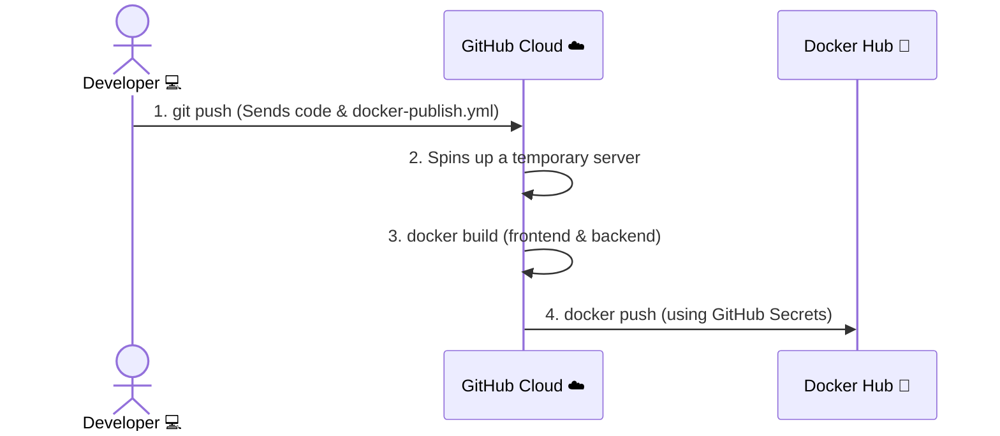

# CI/CD Pipeline Architecture

This document visualizes exactly how your code securely travels from your local computer, gets compiled, and is pushed to Docker Hub automatically!

## 1. Jenkins Pipeline (Local Automation)

### What is happening here?
1. **The Code:** You type `git push` on your laptop.
2. **The Notification:** GitHub notices the change and tries to notify you.
3. **The Bridge:** Because Jenkins lives on your local, private computer, GitHub can't reach it. **Ngrok** acts as a tunnel, catching the notification from the internet and handing it safely to Jenkins.
4. **The Build:** Jenkins wakes up, reads the `Jenkinsfile`, and tells the Docker program installed on your computer to build the images.
5. **The Delivery:** Jenkins logs into Docker Hub and uploads the finished containers so they can be downloaded anywhere.

---

## 2. GitHub Actions Pipeline (Cloud Automation)

### What is happening here?
1. **The Code:** You type `git push`.
2. **The Cloud Server:** GitHub reads `.github/workflows/docker-publish.yml`. It instantly rents a free, temporary cloud server and puts your code inside it.
3. **The Build:** Your local laptop does absolutely zero work. The GitHub cloud server builds the Docker images natively.
4. **The Delivery:** The temporary server logs into Docker Hub using your GitHub Secrets (`DOCKERHUB_TOKEN`) and uploads the images. The temporary server is then immediately destroyed.
