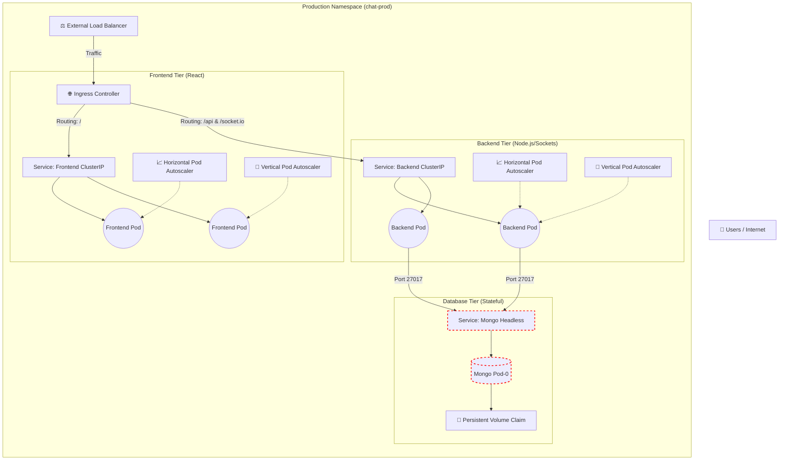

# Enterprise Kubernetes Deployment Architecture

This document outlines the industry-grade, production-ready Kubernetes deployment strategy for the Chattining Application, complete with auto-scaling, strict networking, and high availability.

## System Architecture Diagram

## Core Infrastructure Pillars

### 1. Scaling Automation (HPA & VPA)
To ensure the app never crashes under heavy load but saves money during quiet hours:
*   **Resource Requests & Limits:** Every pod will have hardcoded memory and CPU boundaries (e.g., Backend requests 256Mi RAM, limited to 512Mi).
*   **Horizontal Pod Autoscaler (HPA):** If the backend CPU exceeds 70% utilization during a spike in active chatters, K8s will automatically replicate the pods (scale from 2 to 10 pods) to split the traffic.
*   **Vertical Pod Autoscaler (VPA):** Analyzes historical usage and automatically resizes the baseline memory/CPU allocated to the containers if they are chronically starved.

### 2. Networking & Traffic Routing (Load Balancing)
*   **External Load Balancer & Ingress:** Instead of basic `NodePorts`, we will deploy an Nginx Ingress Controller backed by a Cloud LoadBalancer. It maps the root URL (`/`) to the React Frontend, and dynamically routes API calls (`/api` and `/socket.io`) directly to the backend tier.
*   **Internal ClusterIP Services:** Pods will communicate exclusively via internal DNS (e.g., `backend-service.chat-prod.svc.cluster.local`), entirely invisible to the outside internet.

### 3. Zero-Trust Security (Network Policies)
We will implement "Default Deny" network isolation:
*   **Frontend Policy:** Only allowed to receive traffic from the Ingress Load Balancer. It is physically blocked from talking to the database.
*   **Backend Policy:** Allowed to receive traffic from the Ingress, and is the *only* tier allowed to dispatch traffic to the MongoDB service.
*   **Database Policy:** Strictly blocks all incoming connections except those originating specifically from pods labeled `app: backend`.

### 4. Stateful Reliability (MongoDB)
*   Upgrading from a simple Deployment to a **StatefulSet** for MongoDB. This guarantees predictable network identities (`mongo-0`) and binds the storage permanently, preventing database corruption during node failures.
*   Secret configurations (`JWT_SECRET`, `MONGO_PASSWORD`) will be sealed in K8s `Secrets` and injected strictly at runtime.

## User Review Required

> [!CAUTION]
> Integrating an Ingress Controller, VPA (Vertical Pod Autoscaler), and Network Policies requires advanced components like the **Metrics Server** and a specific networking plugin (like Calico) to be enabled on your cluster. 
> 
> **Are you comfortable with us applying these advanced cluster-level addons to your Minikube environment, or would you like to stick strictly to the HPA/LoadBalancer features for now?**
